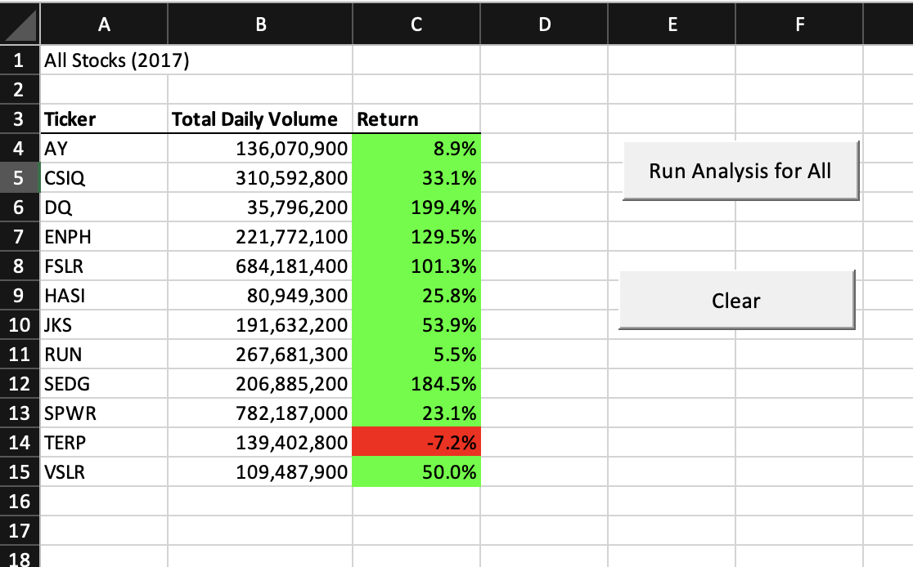
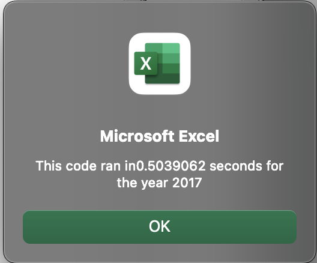
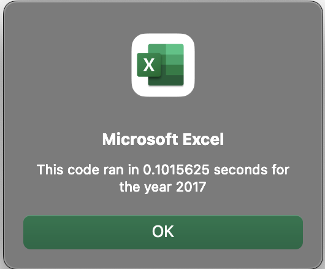
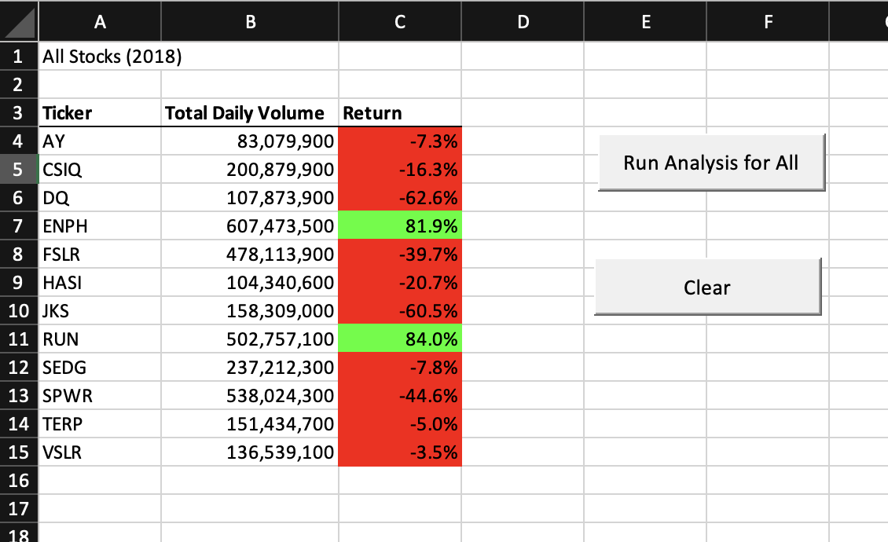
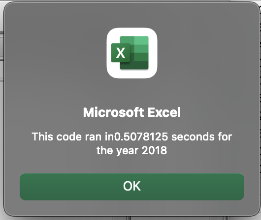
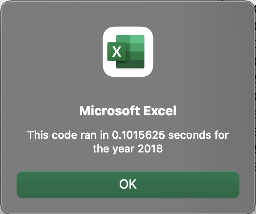

# All Stocks Analysis

## Overview of Project

### Purpose

The code for reviewing the history of 12 stocks across two separate years (2017 and 2018) was running successfully. The target moving forward was refactoring the code to run more efficiently and to have a better backbone to refactor for future purposes depending on the size of the data to be observed.
 
## Results

### 2017 Results

11 of 12 stocks being considered yielded a positive return with 9 of them yielding a return that was at least in the double digits. 2017 was indeed a year for growth with these assets. The code used to initially perform the analysis was refactored to yield performance/efficiency to ~5x as seen below.

Original Code to Perform Analysis

Refactored Code to Perform Analysis

### 2018 Results

10 of 12 stocks being considered yielded a negative return with 6 of them yielding a return that was at least in the double digits in the negative. 2018 was indeed a year for negative returns for a majority of these assets. The code used to initially perform the analysis was refactored to yield performance/efficiency to ~5x as seen below.

ENPH stood to continue to yield positive returns with a decrease from 129.5% to 81.9% between 2017 and 2018.
RUN not only yielded a positive return both years, but its return increased significantly from 5.5% to 84.0% between 2017 to 2018.

Original Code to Perform Analysis

Refactored Code to Perform Analysis

